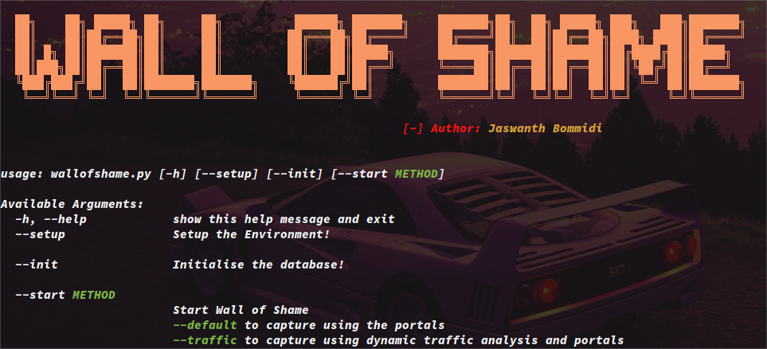
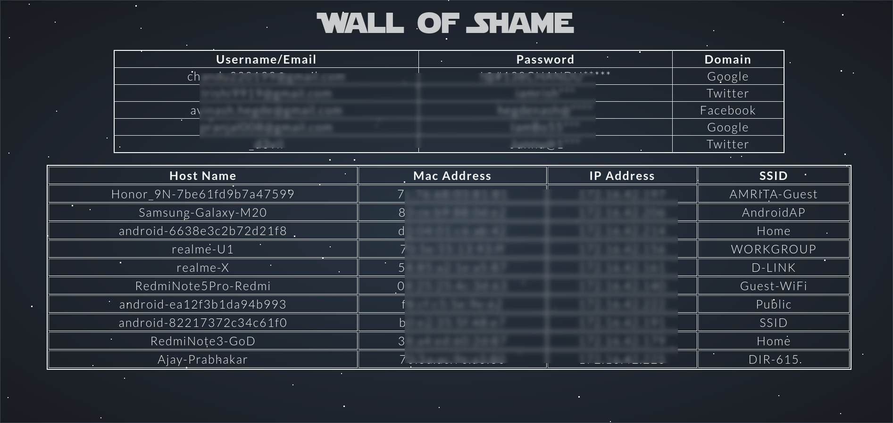

<p align="center">

  
</p>


---


# What is Wall of Shame?
Most of the common web technologies used in the world are still using clear text authentication, Wall of Shame is an implementation to illustrate why this is such a bad idea. Wall of Shame is an OS independent tool that's written in python. Wall of Shame collects the user credentials, sensitive device information from unsecure devices around by creating multiple access points based on the device saved network broadcasts. Once a device connects to the access point created by the Hak5 device, one can get tricked by the portals with spoofed DNS. Further, this tool analyses the traffic of the connected device dynamically for gathering plain text authenticated credentials.


## :book: How it works?
The hardware used for this is a Hak5 Pineapple. The project uses the in-built pineap module of the Hak5 Pineapple for getting devices connected to it. After a device connects to the pineapple, there are two ways for gathering the credentials.
- **Dynamic Traffic Analysis**
  * Wall of Shame analyses the traffic that is passing through the pineapple and checks for plain text authentications and gathers the credentials.
- **Evil Portals**
  * There are some commonly used social website clones inside the repo that needs to be copied inside the pineapple, and then start the evilportal module to gather the credentials.

## :wrench: Tech Stack
- **Hardware**
  * Any Hak5 Pineapple(Preferably Tetra)
- **Languages**
  * Python3, PHP
- **Frameworks**
  * Flask


 ## :minidisc: Instructions & Getting Started

0. Make sure that you have `python3`, `pip`, `sshpass` installed.

1. Clone the repo.
 ```bash
 $ git clone https://github.com/theevilsyn/wall-of-shame/
 $ cd wall-of-Shame
 ```

2. Install the Requirements
```bash
$ pip install -r requirements.txt
```
3. Install the [EvilPortal Module](https://github.com/frozenjava/EvilPortalNano) in the pineapple and copy the portals into the pineapple.
```bash
$ scp -r portals/ root@<pineapple>:/sd/wall-of-shame/portals/
```
4. Create a user for database management and grant the permissions.
```bash
mysql> CREATE USER 'username'@'localhost' IDENTIFIED BY 'password';
mysql> GRANT ALL PRIVILEGES ON * . * TO 'username'@'localhost';
mysql> exit
```

5. Start
```bash
$ ./wallofshame.py --setup
$ ./wallofshame.py --init
$ ./wallofshame.py --start <Method>
```


## :camera: Screenshots





# :gem: Contributors
Developed with :hearts: by Team bi0s

1. [Jaswanth Bommidi](https://twitter.com/theevilsyn) - Network Security Researcher, Team bi0s

## How to Contribute?
1. Fork the repository, clone it locally and run it following the installation instruction above.
2. Find an issue or feature to work on, and put up an issue.
3. Work on the patch or feature, test it and send a pull request referencing the issue.


# Getting Help

## Troubleshooting

Encountered strange behavior or an error? Here are some things to try before you
shoot off that bug report:

**Database Issues**
* Please recheck your database configurations like databse name, user, password and set the permissions accordingly.


* Also check the config file with the configurations you've given.

**Network Routing Issues**
* Please check your routing table for any misconfigurations.
* Make sure that the Pineapple is connected to the internet for the portals to work.

**Portal Logs Error**
* Make sure the path of the evilportal logs is correctly defined in portals/MyPortal.PHP


If all else fails, [file that bug report][github:new-issue]! Please include the
behavior you've observed, the behavior you expected, and any error messages.

It's a great help if you included a backtrace with errors.
